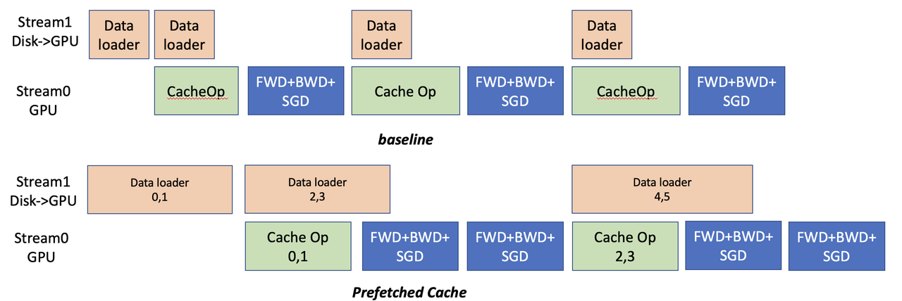

## CachedEmbedding : larger embedding tables, smaller GPU memory budget.

The embedding tables in deep learning recommendation system models are becoming extremly large and cannot be fit in GPU memory.
This project provides an efficient way to train the extremely large recommendation system models.
The entire training runs on GPU in a synchronized parameter updating manner.

This project applies the CachedEmbedding, which extends the vanilla
[PyTorch EmbeddingBag](https://pytorch.org/docs/stable/generated/torch.nn.EmbeddingBag.html#torch.nn.EmbeddingBag) 
with the help from [ColossalAI](https://github.com/hpcaitech/ColossalAI).
The CachedEmbedding use a [software cache approach](https://colossalai.readthedocs.io/en/latest/colossalai/colossalai.nn.parallel.layers.html) to dynamically manage the extremely large embedding table in the CPU and GPU memory space.
For example, this repo can train DLRM model including a **91.10 GB** embedding table on Criteo 1TB dataset allocating just **3.75 GB** CUDA memory  on a single GPU!

In order to reduce the overhead time of the Cache, we designed a "far-sighted" Cache mechanism. 
Instead of only performing cache operations on the first mini-batch, wefetches several mini-batches that will be used later, and performs Cache query operations together.
It also uses a pipeline method to overlap the overhead of data loading and model training, which is shown in the following figures.



Despite the extra cache indexing and CPU-GPU overhead, the end-to-end performance of our system drops very little compared to the torchrec.
However, torchrec usually requires an order of magnitude more CUDA memory requirements.
Also, our software cache is implemented using pytorch without any customized C++/CUDA kernels, and developers can customize or optimize it according to their needs.

### Dataset  
1. [Criteo Kaggle](https://www.kaggle.com/c/avazu-ctr-prediction/data)
2. [Avazu](https://www.kaggle.com/c/avazu-ctr-prediction/data)
3. [Criteo 1TB](https://ailab.criteo.com/download-criteo-1tb-click-logs-dataset/) 

Basically, the preprocessing processes are derived from 
[Torchrec's utilities](https://github.com/pytorch/torchrec/blob/main/torchrec/datasets/scripts/npy_preproc_criteo.py) 
and [Avazu kaggle community](https://www.kaggle.com/code/leejunseok97/deepfm-deepctr-torch)
Please refer to `scripts/preprocess` dir to see the details.

### Usage

1. Installation Dependencies

Install [ColossalAI](https://github.com/hpcaitech/ColossalAI) (commit id e8d8eda5e7a0619bd779e35065397679e1536dcd)

https://github.com/hpcaitech/ColossalAI

Install our customized [torchrec](https://github.com/hpcaitech/torchrec) (commit id e8d8eda5e7a0619bd779e35065397679e1536dcd)

https://github.com/hpcaitech/torchrec

Or, build a docker image using [docker/Dockerfile](./docker/Dockerfile).
Or, use prebuilt docker image on dockerhub.

```
docker pull hpcaitech/cacheembedding:0.2.2
```

lauch a docker container.

```
bash ./docker/launch.sh
```

2. Run

All the commands to run DLRM on three datasets are presented in `scripts/run.sh`
```
bash scripts/run.sh
```

Set `--prefetch_num` to use prefetching.

### Model  
Currently, this repo only contains facebook DLRM models, and we are working on testing more recommendation models.

### Performance

The DLRM performance on three datasets using ColossalAI version (this repo) and torchrec (with UVM) is shown as follows. The cache ratio of FreqAwareEmbedding is set as 1%. The evaluation is conducted on a single A100 (80GB memory) and AMD 7543 32-Core CPU (512GB memory).

|            |   method   | AUROC over Test after 1 Epoch | Acc over test | Throughput | Time to Train 1 Epoch | GPU memory allocated (GB) | GPU memory reserved (GB) | CPU memory usage (GB) |
|:----------:|:----------:|:-----------------------------:|:-------------:|:----------:|:---------------------:|:-------------------------:|:------------------------:|:---------------------:|
| criteo 1TB | ColossalAI |          0.791299403          |  0.967155457  |   42 it/s  |         1h40m         |            3.75           |           5.04           |         94.39         |
|            |  torchrec  |           0.79515636          |  0.967177451  |   45 it/s  |         1h35m         |           66.54           |           68.43          |          7.7          |
|   kaggle   | ColossalAI |          0.776755869          |  0.779025435  |   50 it/s  |          49s          |            0.9            |           2.14           |         34.66         |
|            |  torchrec  |          0.786652029          |  0.782288849  |   81 it/s  |          30s          |           16.13           |           17.99          |         13.89         |
|   avazue   | ColossalAI |          0.72732079           |  0.824390948  |   72 it/s  |          31s          |            0.31           |           1.06           |         16.89         |
|            |  torchrec  |          0.725972056          |  0.824484706  |  111 it/s  |          21s          |            4.53           |           5.83           |         12.25         |

### Cite us
```
@article{fang2022frequency,
  title={A Frequency-aware Software Cache for Large Recommendation System Embeddings},
  author={Fang, Jiarui and Zhang, Geng and Han, Jiatong and Li, Shenggui and Bian, Zhengda and Li, Yongbin and Liu, Jin and You, Yang},
  journal={arXiv preprint arXiv:2208.05321},
  year={2022}
}
```
